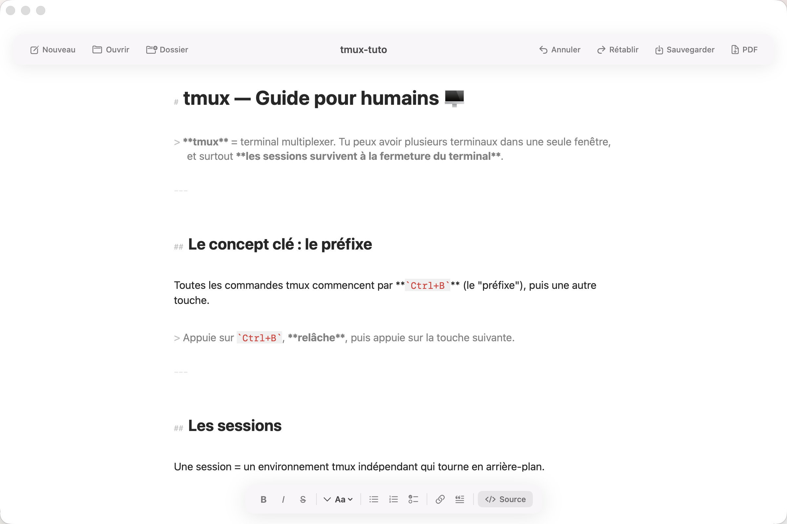
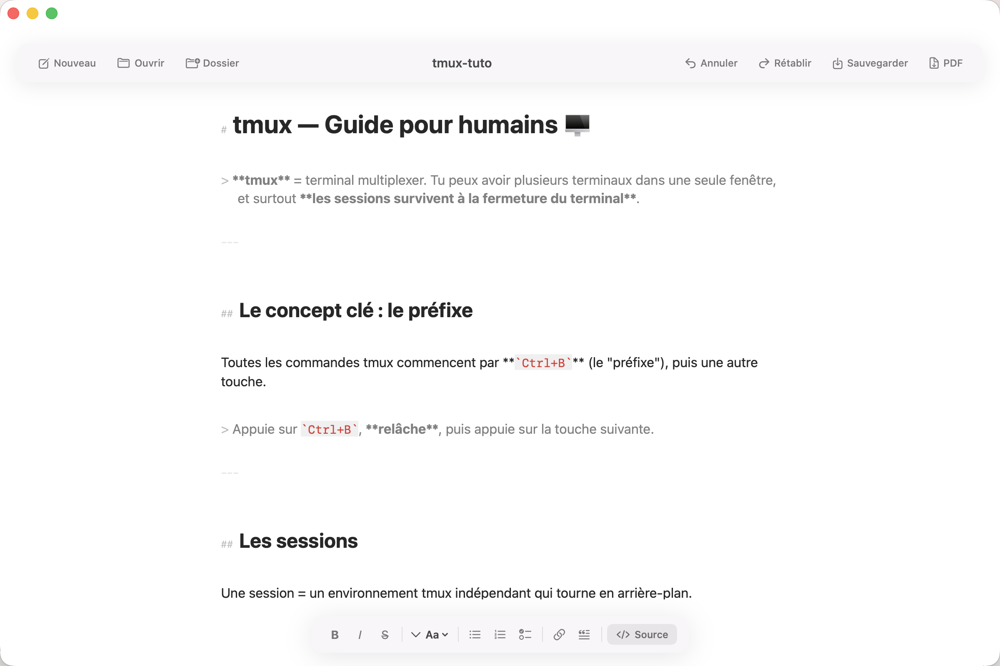

# MD Editor

A minimalist, Typora-inspired Markdown editor for macOS — built entirely with SwiftUI and AppKit, zero dependencies.


---

## Features

- **Live formatted editing** — write Markdown and see it rendered inline as you type (Typora-style), no preview toggle needed
- **680px content column** — centered, readable layout like a well-designed blog article
- **Full formatting toolbar** — Bold, Italic, Strikethrough, Headings (H1–H3), Lists, Checklist, Link, Blockquote
- **Source mode** — toggle to raw Markdown with `⌘\` for when you need to see the syntax
- **Folder sidebar** — open a folder to browse and switch between `.md` files
- **Auto-save** — saves automatically every 30 seconds when a file is open
- **PDF export** — export any document to PDF via WebKit
- **Dark mode** — follows system appearance automatically
- **Glassmorphism UI** — floating header and toolbar with `ultraThinMaterial` blur
- **Native performance** — pure SwiftUI + AppKit, no Electron, no web views in the editor

---

## Screenshots

**Formatted mode** — live rendering as you type, 680px column, glassmorphism UI



**Source mode** (`⌘\`) — raw Markdown, monospace font



---

## Tech Stack

| Layer | Technology |
|-------|-----------|
| UI | SwiftUI (macOS 14+) |
| Editor | NSTextView + NSTextStorage |
| Syntax highlighting | Custom `MarkdownSyntaxHighlighter` |
| Markdown → HTML | Custom `MarkdownParser` (no external deps) |
| PDF export | WKWebView + PDFKit |
| Architecture | MVVM |
| Build | XcodeGen |

---

## Getting Started

### Requirements

- macOS 14.0 Sonoma or later
- Xcode 15+
- [XcodeGen](https://github.com/yonaskolb/XcodeGen) (`brew install xcodegen`)

### Build

```bash
git clone https://github.com/thomasnuggets/md-editor.git
cd md-editor
xcodegen generate
open MDEditor.xcodeproj
```

Then hit `⌘R` in Xcode to build and run.

---

## Keyboard Shortcuts

| Shortcut | Action |
|----------|--------|
| `⌘N` | New document |
| `⌘O` | Open file |
| `⌘⇧O` | Open folder |
| `⌘S` | Save |
| `⌘⇧S` | Save As |
| `⌘B` | Bold |
| `⌘I` | Italic |
| `⌘\` | Toggle Source / Formatted |

---

## Supported File Types

`.md` · `.markdown` · `.mdown` · `.txt`

---

## Project Structure

```
Sources/
├── App/
│   ├── MDEditorApp.swift          # @main entry point + menu commands
│   └── AppDelegate.swift          # Window configuration
├── Views/
│   ├── ContentView.swift          # Root layout, 680px column
│   ├── HeaderView.swift           # Floating glassmorphism header
│   ├── FooterToolbarView.swift    # Floating formatting toolbar
│   ├── SidebarView.swift          # File tree panel
│   ├── MarkdownTextEditor.swift   # NSTextView wrapper
│   └── MarkdownWebView.swift      # WKWebView (PDF export only)
├── ViewModels/
│   └── EditorViewModel.swift      # MVVM logic + TextViewCoordinator
├── Models/
│   └── Document.swift             # MarkdownDocument, FileItem
└── Services/
    ├── MarkdownParser.swift        # Markdown → HTML (no dependencies)
    ├── MarkdownSyntaxHighlighter.swift  # Live NSAttributedString formatting
    └── ExportService.swift         # PDF export via WKWebView
```

---

## License

MIT — do whatever you want with it.

---

*Built with SwiftUI on macOS · by [thomasnuggets](https://github.com/thomasnuggets)*
